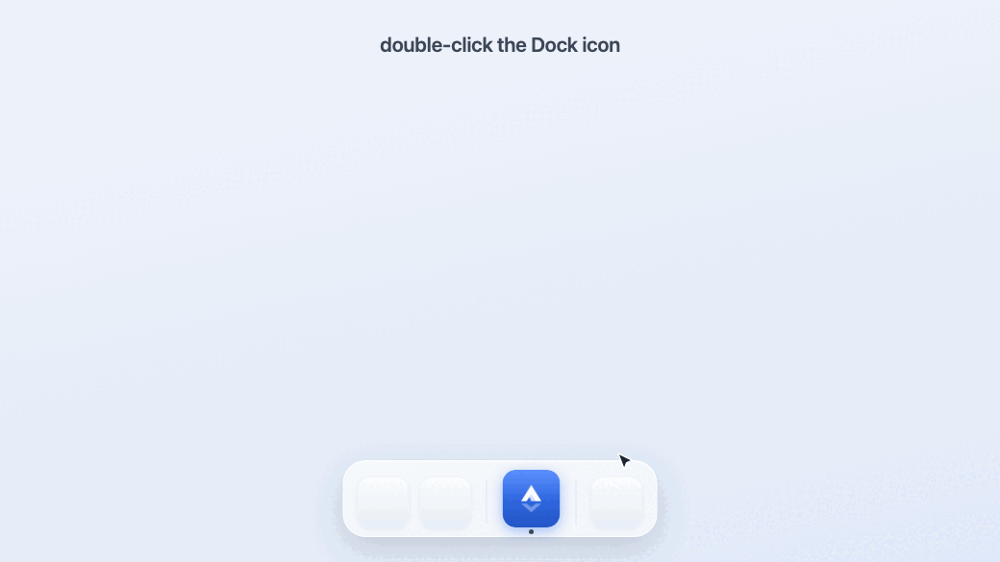
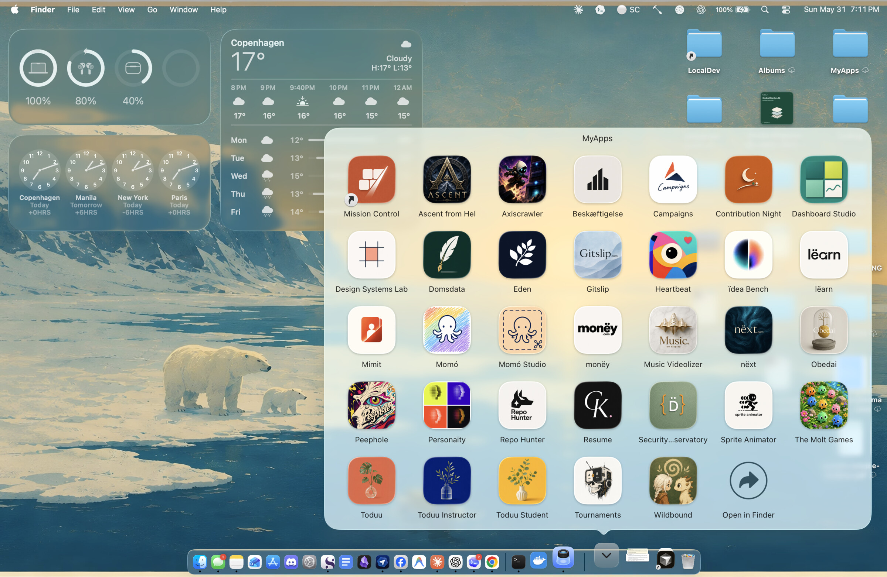

# app-it

[](docs/APP-IT-COMPATIBLE.md)

Turn a local web project — or any hosted web app — into a macOS Dock-launchable `.app` bundle — a native window, its own Dock icon, and clean start/stop — **without Electron, Tauri, or a rewrite.**

> **Unofficial community project** — not affiliated with, endorsed by, or sponsored by Anthropic or OpenAI. "Claude Code" and "Codex" are their respective owners' marks, named here only to say which assistants app-it plugs into. This is an independent open-source tool built by one developer.



*A real `app-it` build, in motion. `Fjord` is an ordinary local web project (`node server.js`); app-it turns it into a native macOS app — double-click launches it, the window opens with its own Dock icon, and ⌘Q quits the app **and** frees the dev-server port. The actual generated app, not a mockup.*

**Status** — Working, in daily use. The launcher templates are battle-tested across 12+ real projects; `v0.1.0` is the first standalone, marketplace-installable release. macOS only, by design.

**Windows beta** — macOS is in daily use; Windows is an early beta, now with its first real-hardware fixes but still needing more. A complete sibling plugin (`plugins/app-it-windows/`), gated by a required `windows-latest` CI job (build · PowerShell lint · manifest parse · icon round-trip), mirrors the macOS contract with Windows primitives. The author runs only macOS, so for a long time it had never touched real Windows hardware; that changed with [#8](https://github.com/Christian-Katzmann/app-it/pull/8), the first run on an actual Windows machine, and a run of fixes since — a real start, not a finish line. If you're on Windows and want to help harden it, the doorway is [docs/WINDOWS.md](docs/WINDOWS.md).

**Local-first** — app-it reads your project *on your machine* to choose a launcher strategy. It uploads nothing, runs no telemetry, adds no runtime dependencies, and never touches your business-logic source. The only thing it produces is an `.app` on your own Dock. For a hosted web app — a published Claude Artifact, a deployed dashboard, an internal tool — the supported networked path is explicit: wrap the hosted URL so the host handles login and keeps usage on each user's own account. See [Privacy](PRIVACY.md) and [Terms](TERMS.md) for the plain-language policy.

`app-it` is an assistant-agnostic plugin/skill. It works with **Claude Code** and **Codex**, and builds a small, repeatable launcher around an existing local project or hosted web app so that double-clicking starts the right runtime, opens a native window, keeps the Dock icon as *your* app, and cleans up when you quit.

## What app-it is not

- **Not Electron, Tauri, or a native rewrite.** It wraps your existing dev setup; it doesn't replace it, migrate it, or add a bundler to your dependency tree.
- **Not a general signed distribution system.** No notarization, no App Store, no auto-update, no installer. A wrapper around a hosted web app is self-contained enough to zip and share, but it is still an ad-hoc-signed local bundle; recipients must trust the bundle and sign in with their own account.
- **Not cross-platform.** macOS only — and on purpose. Windows is a genuinely different problem (WebView2, `.lnk`, `.ico`, SmartScreen), so it belongs in a separate plugin rather than a blurred promise. See [Compatibility](docs/COMPATIBILITY.md).
- **Not a hosted service.** Nothing runs in the cloud and there is no live demo to visit — the proof is the apps on your own Dock (the Stack further down is real).

## How it works

```text
  WHAT YOU HAVE               WHAT APP-IT DOES           WHAT YOU GET
  ───────────────────────     ──────────────────────     ───────────────────────────
  a local web project         inspects it from disk,     YourApp.app on your Dock
  Vite React, SvelteKit,      picks a strategy, then     · its own icon
  Astro, Next, static, or ──▶ builds & signs a .app  ──▶ · native window, one click
  a hosted web app URL        around a WebKit shell      · ⌘Q quits & frees the port
```

Under the hood, app-it:

- **Inspects before it touches anything** — project type, dev scripts, ports, browser-API needs, icon sources.
- **Picks a launcher strategy** — a native Swift `WKWebView` shell by default (so the Dock icon stays *yours*), Chrome `--app` mode only when a project needs Chromium-only APIs.
- **Wraps a hosted web app without shared secrets** — set `external_url` to a hosted link (for example, a published Claude Artifact); each user signs in within the app window and uses their own account.
- **Copies proven, hard-won templates** into the project rather than re-deriving fragile launcher logic each time.
- **Builds and ad-hoc-signs a real `.app`** — universal (arm64 + x86_64), Gatekeeper-friendly, with a generated `.icns`.
- **Gets the lifecycle right** — closing the window (⌘W / red-X) leaves the dev server warm for a ~250 ms re-launch; ⌘Q quits the app *and* frees the port.
- **Writes a report** explaining every change and exactly how to undo it.

> **Finished app? There's a lighter companion.** `app-it` runs your project's dev server — perfect while you're still building. Once an app is *done*, it doesn't need one: the **`app-it-static`** companion serves the built output (`dist/`, `build/`, `out/`, …) so a finished app costs ~15 MB instead of a dev server's ~300–700 MB. Same native window, same Dock Stack — reach for it only when an app is done. [How it works →](plugins/app-it-static/skills/app-it-static/SKILL.md)

## Requirements

- macOS.
- Claude Code or Codex for marketplace installation.
- `swiftc` (Xcode Command Line Tools) for the native WebKit shell — `xcode-select --install`.
- `python3` (also from the Xcode Command Line Tools) for `app-it-static`'s server mode.
- Chrome only if a project needs the Chrome fallback path.

## Install

**Claude Code:**

```text
claude plugin marketplace add Christian-Katzmann/app-it
claude plugin install app-it@app-it
```

**Codex:**

```text
codex plugin marketplace add Christian-Katzmann/app-it
codex plugin add app-it@app-it
```

Then, from inside any local web project, ask your assistant:

```text
/app-it
```

Natural triggers work too: *"make this clickable from the Dock"*, *"give this an icon"*, *"dockify this"*, *"package this as a local app"*.

To wrap a hosted web app, point app-it at its URL rather than copied source. A Claude Artifact is the common case: use the hosted artifact link, since a raw `.jsx` file works as an ordinary local React app only when it does not depend on Claude's hosted runtime (`window.claude`, `window.storage`, MCP prompts, or Claude-provided auth).

*Optional:* for finished apps, also install the lighter companion — `claude plugin install app-it-static@app-it` (or `codex plugin add app-it-static@app-it`), then run `/app-it-static`.

### Local development (before publication)

```text
claude plugin marketplace add /path/to/app-it
claude plugin install app-it@app-it

codex plugin marketplace add /path/to/app-it
codex plugin add app-it@app-it
```

### Manual skill install

Marketplace install is preferred. To copy just the skill folder:

```bash
./install.sh            # auto-detects Claude Code and/or Codex, asks before overwrite
./install.sh --dry-run  # show what it would do, write nothing
```

## What it adds to a target project

All additions are additive and reversible:

- `scripts/app-it.config.json` — single source of truth for the app(s)
- `scripts/desktop-build.sh`, `desktop-install.sh`, `desktop-quit.sh`, `desktop-doctor.sh`, `desktop-verify.sh`, `wrapper.swift`, …
- `assets/<slug>-icon.png` or `.svg`
- `desktop/<App Name>.app/` *(gitignored — regenerated by the build)*
- `docs/desktop-launcher.md` and an `app-it-report.md` decision log
- `package.json` scripts: `desktop:build`, `desktop:install`, `desktop:quit`, `desktop:doctor`, `desktop:verify`

Installed apps land in `~/Applications/App It/` by default. Drag that folder to the right side of the Dock once and every future appified app appears in its Stack automatically. Override with `APP_IT_INSTALL_DIR`.

By default, generated launchers use `port_mode: "fallback"` so sibling local
apps can coexist by scanning upward from the preferred port. Use
`port_mode: "fixed"` only when the app must stay on one exact localhost origin,
such as browser storage or OAuth callbacks.



*A real `MyApps` Stack, not a mockup. Every icon is an ordinary local web project app-it turned into a native app — its own icon, its own window, one click to launch. Do this a dozen times and your Dock fills itself.*

## Safety model

`app-it` only makes additive, reversible changes. It will not rewrite product logic, add runtime dependencies, require a terminal window to stay open, or assume an already-running dev server. It may start and stop local dev-server processes during verification. It never collects telemetry, sends project data anywhere, or handles secrets. See [SECURITY.md](SECURITY.md).

## app-it compatible

`app-it` is the **verified last mile for AI-built local software** — and that
last mile is checkable. A repo is *app-it compatible* when it has an
`app-it.config.json` manifest and `app-it verify --strict` passes: not "the
build script ran", but the app builds, launches, serves on its port, owns its
own process, and tears down cleanly. The badge above is that gate, dogfooded on
this repo.

The norm — for **any** agent, Claude Code or Codex or otherwise:

> **Don't declare a local app done until `app-it verify --strict` passes.**

`verify --json` is a [stable, versioned contract](plugins/app-it/skills/app-it/references/verification.md),
and this repo ships a reusable GitHub Action so your CI can assert it:

```yaml
- uses: Christian-Katzmann/app-it/.github/actions/app-it-verify@v0.2.0
```

The full definition, the JSON gate, the Action's inputs, and the badge snippet
live in [docs/APP-IT-COMPATIBLE.md](docs/APP-IT-COMPATIBLE.md).

## Validate this repo

```bash
./scripts/validate.sh
```

This is the one-command check: it validates manifest shape, shell syntax, template presence, plist syntax, Swift typechecking, and Claude plugin validation (when the `claude` CLI is available). CI runs the same script on `macos-latest`.

For launcher/runtime changes, also run the behavioral suite:

```bash
./scripts/test-fixtures.sh
```

It builds tiny fixture apps and checks the lifecycle app-it promises: bundle shape, runtime ports, ownership, doctor/verify JSON, warm reattach, and cleanup.

## For AI agents

This repo *is* agent tooling, and agents are expected to work in it. Start with [AGENTS.md](AGENTS.md) — it names the non-obvious conventions (templates are canonical, trust disk over docs, the macOS-only boundary) and the safe first commands. Architectural decisions and their rejected alternatives live in [docs/decisions/](docs/decisions/).

## More

- [Troubleshooting](docs/TROUBLESHOOTING.md)
- [Compatibility](docs/COMPATIBILITY.md)
- [Changelog](CHANGELOG.md) · [Contributing](CONTRIBUTING.md)

## Community nudge

The `app-it-static` companion was inspired by feedback from the r/ClaudeAI launch thread, and the project keeps growing on community help. Thanks to:

- **`TechExpert2910`** for pointing out that finished apps shouldn't need a full dev server, and that Vercel/PWA-style workflows are far lighter — the nudge that became "serve the build locally, not a dev server."
- **`K_M_A_2k`** for highlighting that deployed/static proof-of-concepts are often the standard workflow and are easier to share.
- **`Vo_Mimbre`** for the corporate-environment caveat: external hosting like Vercel isn't always approved, which is exactly why a *local* static launcher earns its place even for finished projects.
- **`Firnschnee`** for becoming the Windows beta's real-hardware tester — the first proof it actually runs, then a run of fixes each traced and verified on a real Windows 11 box: the window title, the `app-it-host` label stuck in the taskbar right-click menu, and a graceful path when the WebView2 runtime is missing (offer the installer instead of a dead window).
- **`jeremyellison`** for the feature request that became Claude Artifact packaging — including the key constraint that distribution must keep every user on their own Claude plan, no shared secrets, which is exactly the boundary the shipped wrapper honors.
- **`SohamKela`** for hardening the native window so a restored frame can't open off-screen or postage-stamp sized, adding first-class Vite + React, SvelteKit, and Astro dev recipes, and — most recently — the URL-only launcher that wraps a hosted web app (a published Claude Artifact is the common case) in a Dock window: no local server, no shared secrets, each recipient signed into their own account.

## License

MIT — see [LICENSE](LICENSE).
